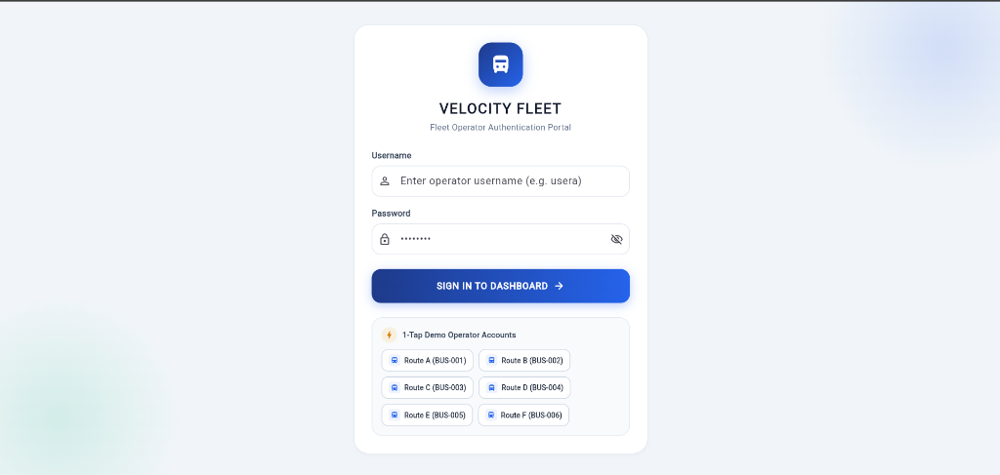
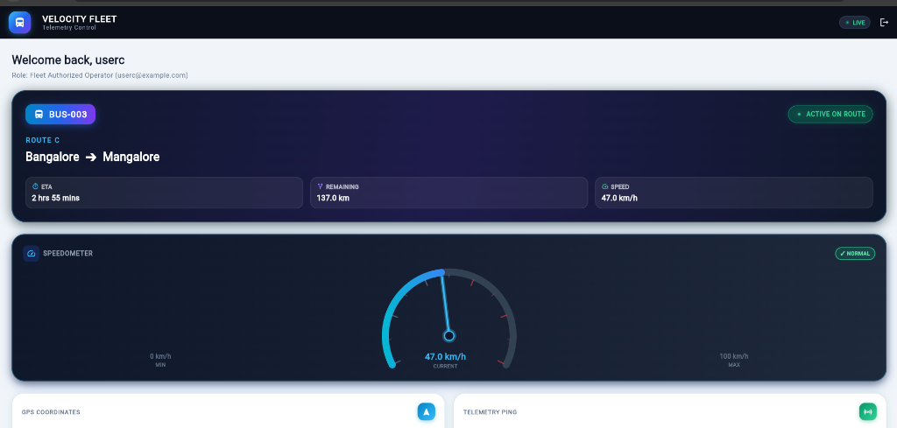
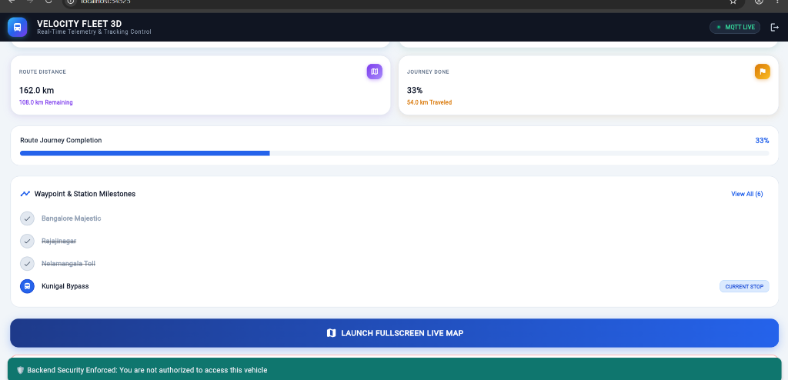
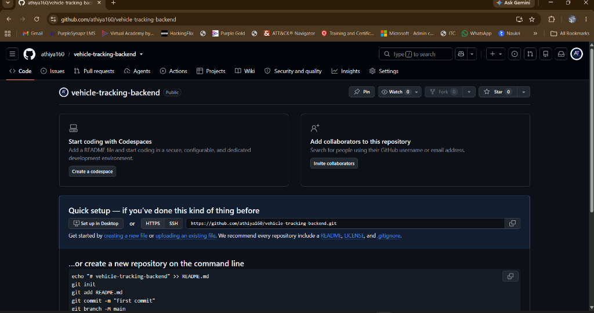
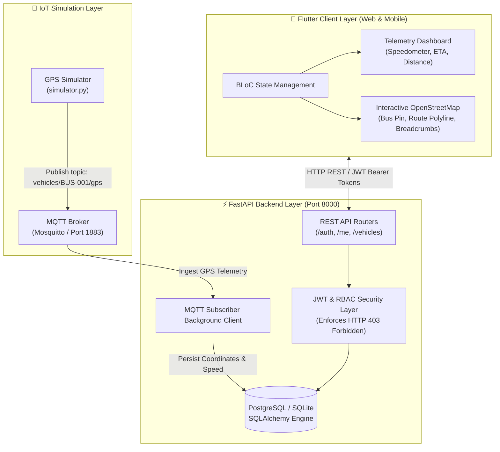

# 🚍 Velocity Fleet — Full-Stack Real-Time Vehicle Tracking System

[](https://fastapi.tiangolo.com)
[](https://flutter.dev)
[](https://www.postgresql.org/)
[](https://mosquitto.org/)
[](https://www.docker.com/)
[]()
[]()

> A production-ready, full-stack vehicle tracking application featuring **MQTT-driven telemetry ingestion**, **JWT role-based authorization**, **live OpenStreetMap visualization with route polylines & historical breadcrumbs**, and dynamic **BLoC-managed Flutter frontend**.

---

## 📸 Application Screenshots

| 🔐 Login & 1-Tap Operator Auth | 📊 Live Telemetry & Speedometer |
|:---:|:---:|
|  |  |
| **Operator authentication with 1-tap test accounts** | **Live speed gauge, ETA, remaining distance, & ping status** |

| 🗺️ Interactive Live Map & Breadcrumbs | 🛡️ RBAC 403 Forbidden Security Check |
|:---:|:---:|
|  |  |
| **OpenStreetMap with bus pin, polyline, and GPS history** | **Backend blocks unauthorized vehicle queries with HTTP 403** |

---

## 🎥 Video Demonstration
* **Video Walkthrough Link:** [Google Drive / Loom Video Submission Link](https://drive.google.com/) *(Add your recorded video link here)*
* **Interactive API Docs (Swagger UI):** [http://127.0.0.1:8000/docs](http://127.0.0.1:8000/docs)

---

## 📐 System Architecture



---

## 📋 Assessment Requirements Compliance Matrix

| Requirement | Implementation Details | Status |
| :--- | :--- | :---: |
| **Multiple User Login** | Secure bcrypt hashing, JWT issuance via `/auth/login`, dedicated credentials for `usera` through `userf` | ✅ Complete |
| **Relational Database** | Configured for **PostgreSQL** with automatic fallback to **SQLite** using SQLAlchemy ORM | ✅ Complete |
| **User → Route Assignment** | Relational mapping: `usera` → Route A, `userb` → Route B, `userc` → Route C, etc. | ✅ Complete |
| **User → Vehicle Assignment** | Relational mapping: `usera` → `BUS-001`, `userb` → `BUS-002`, `userc` → `BUS-003` | ✅ Complete |
| **MQTT GPS Ingestion** | Async MQTT subscriber ingesting `latitude`, `longitude`, `speed`, and `timestamp` from `vehicles/{id}/gps` | ✅ Complete |
| **Live Vehicle Location** | Polling `/me/vehicle/location` returns latest GPS coordinates and dynamic telemetry | ✅ Complete |
| **Historical GPS Breadcrumbs** | `/vehicles/{id}/history` returns complete chronological breadcrumb path | ✅ Complete |
| **Flutter Interactive Map** | OpenStreetMap (flutter_map), customized vehicle marker, planned route polyline, historical trail | ✅ Complete |
| **RBAC Security (403)** | Strict backend dependency check returns **HTTP 403 Forbidden** when querying unauthorized vehicles | ✅ Complete |
| **Bonus: Speedometer Gauge** | Dynamic analog/digital speedometer displaying real-time speed in km/h | ✅ Complete |
| **Bonus: Remaining Distance/ETA**| Haversine calculation computing remaining route distance and estimated arrival time | ✅ Complete |
| **Bonus: Docker Compose** | Multi-service `docker-compose.yml` for Mosquitto MQTT, PostgreSQL DB, and FastAPI backend | ✅ Complete |

---

## 🔑 Pre-Seeded Test Credentials

| Username | Password | Assigned Vehicle | Assigned Route | Start Point → End Point |
| :--- | :--- | :--- | :--- | :--- |
| **`usera`** | `password123` | `BUS-001` | Route A | Bangalore ➔ Mysore |
| **`userb`** | `password123` | `BUS-002` | Route B | Bangalore ➔ Chennai |
| **`userc`** | `password123` | `BUS-003` | Route C | Bangalore ➔ Mangalore |
| **`userd`** | `password123` | `BUS-004` | Route D | Bangalore ➔ Hyderabad |
| **`usere`** | `password123` | `BUS-005` | Route E | Bangalore ➔ Goa |
| **`userf`** | `password123` | `BUS-006` | Route F | Bangalore ➔ Coimbatore |

---

## 🚀 Quickstart Guide

### 1. Backend Setup & Run

```bash
cd vehicle-tracking-backend

# 1. Create and activate virtual environment
python -m venv .venv
.venv\Scripts\activate   # Windows
# source .venv/bin/activate # macOS/Linux

# 2. Install dependencies
pip install -r requirements.txt

# 3. Start Mosquitto Broker (or local broker script)
python run_local_broker.py

# 4. In a new terminal, launch the FastAPI server
python -m uvicorn app.main:app --reload

# 5. In a new terminal, run the GPS Simulator
python gps_simulator/simulator.py
```

* Swagger API Documentation: **[http://127.0.0.1:8000/docs](http://127.0.0.1:8000/docs)**
* Run Automated Tests:
  ```bash
  pytest -v
  ```

---

### 2. Flutter Client Setup & Run

```bash
cd vehicle-tracking-flutter

# 1. Get Flutter dependencies
flutter pub get

# 2. Run static analysis & tests
flutter analyze
flutter test

# 3. Run application (Web / Chrome)
flutter run -d chrome

# 4. Or run on Android Device / Emulator
flutter run
```

---

## 🐳 Docker Deployment (One-Click)

To launch the full backend stack (PostgreSQL + Mosquitto MQTT + FastAPI Backend) in containers:

```bash
cd vehicle-tracking-backend
docker compose up --build -d
```

---

## 🛡️ Security & Role-Based Access Control (RBAC)

The backend enforces strict authorization via FastAPI dependency injection:
* Endpoint: `GET /vehicles/{vehicle_id}/location`
* If `usera` (assigned to `BUS-001`) attempts to access `/vehicles/BUS-002/location`, the backend immediately rejects the request:
  ```json
  {
    "detail": "Unauthorized: You do not have permission to access vehicle BUS-002."
  }
  ```
  *(HTTP Status: `403 Forbidden`)*

---

## 📂 Repository Structure

```text
vehicle-tracking-system/
├── README.md                      # Master fullstack documentation
├── docs/                          # Screenshots & architecture diagrams
│   └── screenshots/
├── vehicle-tracking-backend/      # FastAPI Backend, Database, MQTT & Tests
│   ├── app/                       # Core, Models, Routers, Schemas, Services
│   ├── gps_simulator/             # Realistic route GPS generator
│   ├── mosquitto/                 # MQTT Broker configuration
│   ├── tests/                     # 11 automated pytest test cases
│   ├── Dockerfile
│   ├── docker-compose.yml
│   └── requirements.txt
└── vehicle-tracking-flutter/      # Flutter Mobile & Web Application
    ├── lib/                       # BLoC, Data Models, Repositories, Screens, Widgets
    ├── test/                      # Flutter widget & unit tests
    └── pubspec.yaml               # Flutter package configuration
```
